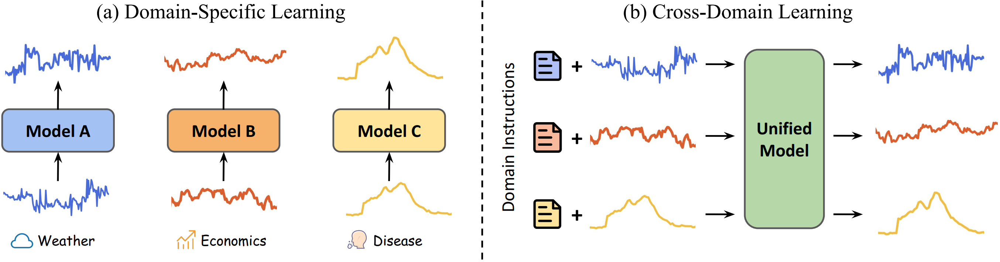

# UniTime

This is the official repository of our WWW 2024 paper [UniTime: A Language-Empowered Unified Model for Cross-Domain Time Series Forecasting](https://arxiv.org/pdf/2310.09751.pdf). UniTime aims to explore the potential of utilizing a unified model for generalization across time series application domains. This code base offers an implementation to facilitate cross-domain time series learning research.




## Getting Started

### Requirements
Our experimental environments include Python 3.9, Pytorch 1.13.1 with CUDA 11.6, and transformers 4.31.0. To install all dependencies, please use the below command.
```
pip install -r requirements.txt
```

### Datasets
The pre-processed datasets can be obtained from the link [here](https://drive.google.com/drive/folders/13Cg1KYOlzM5C7K8gK8NfC-F3EYxkM3D2?usp=sharing). Then you may choose to download `all_datasets.zip`, place this zip file into the `dataset` folder, and finally unzip the file.

### Running
In general, we use a csv file to indicate the executing tasks (including training and evaluations) during the cross-domain learning process. There are five columns in the file.

(1) Data: the name of a dataset, corresponding to a config file in the folder `data_configs`.

(2) Prediction: the prediction length.

(3) Train: the indicator for training.

(4) Valid: the indicator for validation.

(5) Test: the indicator for testing.

For example, the below command is used to train one model for the tasks listed in the file `execute_list/train_all.csv`. Note that the argument `max_token_num` should be set to a value larger than the combined number of tokens in both language instructions and time series patches.
```
python run.py --gpu 0 --training_list execute_list/train_all.csv --max_token_num 17
```

In the case of evaluating the pretrained model, please setting the argument `is_training` to 0 and specifying the inference tasks via `inference_list`.
```
python run.py --gpu 0 --training_list execute_list/train_all.csv --max_token_num 17 --is_training 0 --inference_list execute_list/inference_all.csv
```


## Citation
If you find our work useful in your research, please cite:
```
@inproceedings{liu2024unitime,
  title={UniTime: A Language-Empowered Unified Model for Cross-Domain Time Series Forecasting},
  author={Liu, Xu and Hu, Junfeng and Li, Yuan and Diao, Shizhe and Liang, Yuxuan and Hooi, Bryan and Zimmermann, Roger},
  booktitle={Proceedings of the ACM Web Conference 2024},
  year={2024}
}
```


## Acknowledgement
We appreciate the following github repository for sharing the valuable code base and datasets:

https://github.com/thuml/Time-Series-Library